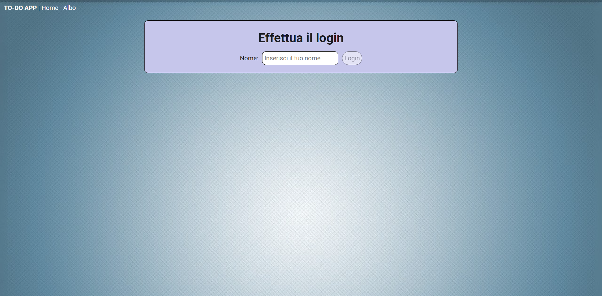
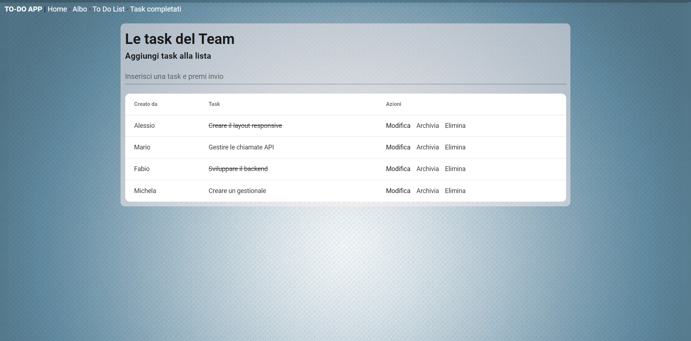
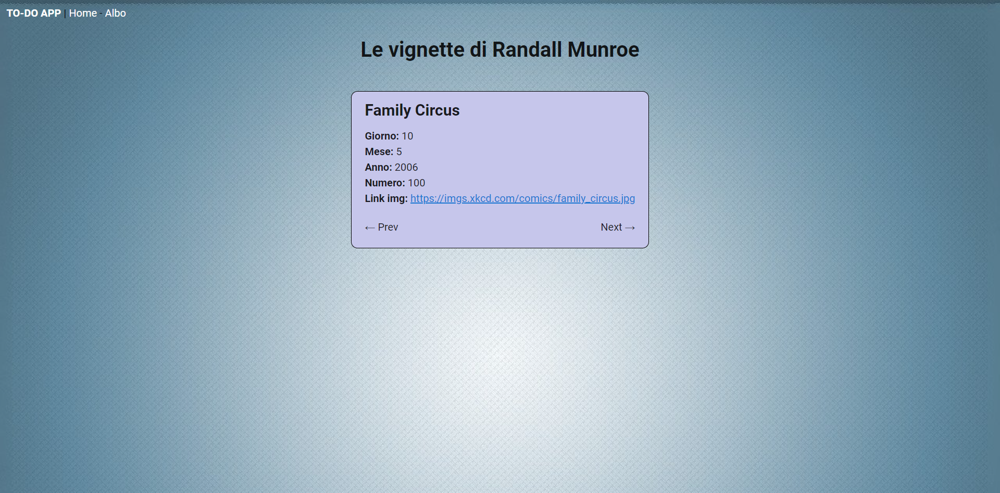

Esercizio con Vue 2, Vuetify e Axios

Creare un progetto con le seguenti caratteristiche:
  - Login:
      - creare un fake login per salvare il nome dell'utente
      - validazioni del login
          - impedire la visualizzazione delle task in caso di utente non loggato
      - fake logout
  - To do list:
      - inserire una task
      - confermare task, annullare la conferma, eliminare, modificare e archiaviare una task
      - visualizzare la lista di task archiviate/completate
      - poter annullare l'archiviazione
      - visualizzare il nome di chi ha inserito la task e il nome di chi ha archiviato la task
      - filtraggio:
          - poter filtrare per ricerca testuale
          - poter filtrare tramite utente (tramite una select)
  - Chiamata Axios:
      - ricevere i dati e stampare in pagina la vignetta n.100 dell'artista Randall Munroe
      - bottoni PREV e NEXT per visualizzare il numero precedente o successivo

FAKE LOGIN:

TO DO LIST:

ALBO - VIGNETTE:

